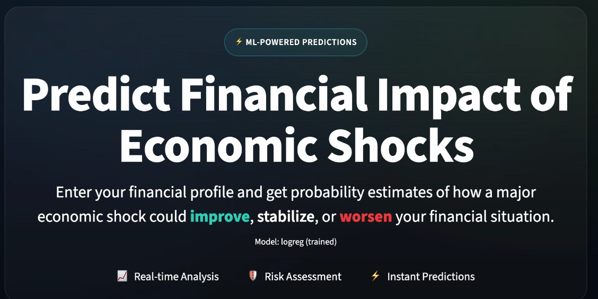

# 📊 Predicting Financial Impact of Economic Shocks Using Machine Learning
### SDSS Datathon 2026 Team 36

---


## 🔍 Problem Overview

Economic shocks such as COVID-19 affect households differently.  
Some experience financial deterioration, others remain stable, and a small portion improve.

**Research Question**

> Given an individual's demographic and financial characteristics, what is the probability distribution of their financial outcome during a future economic shock?

Instead of predicting a single deterministic outcome, our model estimates:

- 🟢 Probability of **Improved**
- 🟡 Probability of **Stayed the Same**
- 🔴 Probability of **Worsened**

This allows us to measure financial vulnerability and resilience at the individual level.

---

## 📂 Dataset

**Source:** Survey of Financial Security (SFS)

### 🎯 Target Variable

`PATTSITC`

| Code | Meaning |
|------|---------|
| 1 | Improved |
| 2 | Worsened |
| 3 | Stayed Same |

---

### 📥 Input Features

- Age Group  
- Province of Residence  
- Education Level  
- After-Tax Income  
- Homeownership Status  
- Mortgage Debt  
- Student Loan Debt  
- Credit Card Debt  
- Line of Credit Debt  
- Bank Deposits  
- TFSA Balance  

---

## 🧠 Methodology

### 1️⃣ Data Preprocessing

- Removed missing / invalid survey codes  
- One-Hot Encoded categorical variables  
- Train/Test split: 80% / 20%

---

### 2️⃣ Model Development

We trained multi-class classification models:

- **Multinomial Logistic Regression**
- **Random Forest**
- (Optional) XGBoost

Models output full probability distributions:

\[
P(Improved), \quad P(Worsened), \quad P(Stayed\ Same)
\]

Final prediction:

\[
Prediction = argmax(P)
\]

---

### 3️⃣ Evaluation Metrics

- Accuracy  
- Macro F1-Score  
- Confusion Matrix  

We prioritize **Macro F1-Score** to fairly evaluate class imbalance.

---

## 🧪 Example Prediction

### User Profile

- Age: 26–35  
- Province: Ontario  
- Income: $55,000  
- Credit Card Debt: $8,000  
- Student Loan: $15,000  
- Savings: $2,500  
- Homeowner: No  

### Model Output

```
Predicted Outcome: Worsened
Confidence: 0.64

Probability Distribution:
Improved: 0.14
Worsened: 0.64
Stayed Same: 0.22
```

---

## 📈 Key Insights

- High unsecured debt strongly predicts worsening outcomes  
- Low liquidity increases vulnerability  
- Province remains statistically significant  
- Younger age groups show higher predicted vulnerability  

---

## 📁 Project Structure

```
DATATHON-2026/
│
├── final_submission.ipynb
├── README.md
├── requirements.txt
│
├── data/
│   └── personal_finance_dataset.xlsx
│
├── src/
│   ├── config.py
│   ├── data_load.py
│   ├── preprocess.py
│   ├── train.py
│   ├── evaluate.py
│   ├── predict_user.py
│   └── artifacts.py
│
├── ui/
│   └── app_streamlit.py
```

---

## ▶️ How to Run

### 1️⃣ Clone Repository

```bash
git clone https://github.com/your-username/datathon-2026.git
cd datathon-2026
```

### 2️⃣ Create Virtual Environment

Mac / Linux:

```bash
python3 -m venv venv
source venv/bin/activate
```

Windows:

```bash
python -m venv venv
venv\Scripts\activate
```

### 3️⃣ Install Dependencies

```bash
pip install -r requirements.txt
```

If pip is not recognized:

```bash
python3 -m pip install -r requirements.txt
```

### 4️⃣ Run Notebook

```bash
jupyter notebook final_submission.ipynb
```

### 5️⃣ Run Interactive UI (Optional)

The easiest way to explore our model is through the Streamlit interface.
Run the following command in the project root:
```bash
streamlit run ui/app_streamlit.py
```

---

## ⚠️ Limitations

- Outcome variable is self-reported perception  
- No macroeconomic indicators included  
- Cross-sectional dataset  
- Not intended for financial or credit decisions  

---

## 🛡 Ethical Considerations

- No personally identifiable information used  
- Bias across age and province evaluated  
- Not designed for automated lending decisions  

---

## 🤖 AI Usage Disclosure

AI tools (e.g., ChatGPT) were used for:

- Debugging assistance  
- Code structure suggestions  
- Documentation formatting  

All modeling logic, feature engineering, and evaluation decisions were implemented and validated by the team.

---

## 🏆 Impact

This project helps identify:

- Financially vulnerable households  
- Risk factors driving economic deterioration  
- Regional disparities in financial resilience  

These insights can inform:

- Targeted support programs  
- Crisis-response policy  
- Financial resilience planning  
